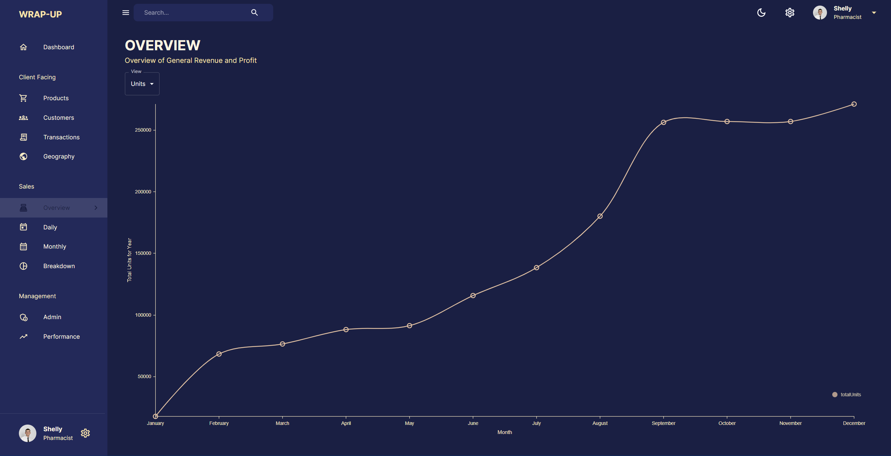

# Full-Stack Wrap-up Dashboard App Using MongoDB, Express, ReactJS and Material UI

Complete full-stack implementation of a dashboard from scratch, providing a light and a dark mode, providing multiple charts generated with Nivo, other listing tools, as well as a dashboard putting all of these visualization tools together. These various visualizations use data stored on MongoDB in real time, so this dashboard has a backend implementation as well.

 

 
