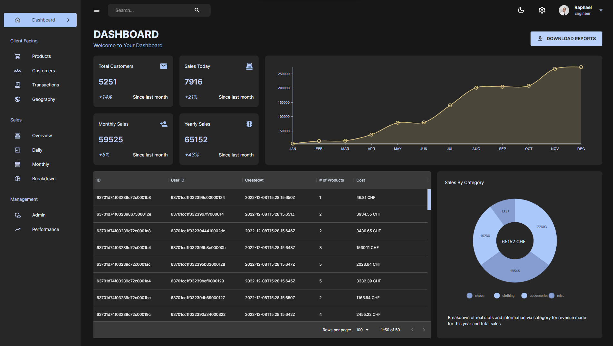

# Financial Dashboard App Using React, Express and MongoDB

Full-stack implementation of a dashboard providing :
- a light and a dark mode
- multiple charts generated with Nivo
- a dashboard putting all the different visualizations together

The app backend is implemented using Express and fetches data in real time from a MongoDB database.

Website deployed on <a href='https://rmarieta-dashboard.onrender.com/'>the following link</a>, using the free plan from <a href='https://render.com/'>render.com</a> (frontend or backend might be down since it was using the free plan).

 

 

The design is mobile responsive and adapts to the size of the screen. The sidebar is collapsed by default on mobile mode and it switches to a vertical display for the dashboard under a certain screen width.

 

 

### Demo of the app

<video src="https://user-images.githubusercontent.com/33026272/216689690-a45b8a79-b0c9-46a2-aee7-14957be0a3f1.mp4">
</video>

