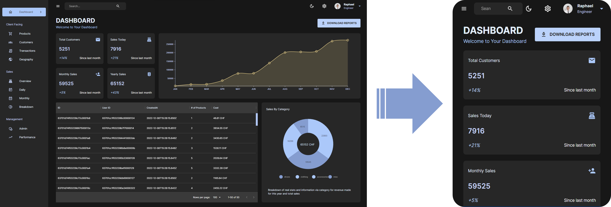

# Full-Stack Sales Dashboard App Using MongoDB, Express, ReactJS and Material UI

Complete full-stack implementation of a dashboard from scratch, providing a light and a dark mode, providing multiple charts generated with Nivo, other listing tools, as well as a dashboard putting all of these visualization tools together. These various visualizations use data stored on MongoDB in real time, so this dashboard has a backend implementation as well.

Website deployed on <a href='https://rmarieta-dashboard.onrender.com/'>the following link</a>, using the free plan from <a href='https://render.com/'>render.com</a> (it might therefore take a while to load the first time).

 

 

The design is mobile responsive and adapts to the size of the screen. The sidebar is collapsed by default on mobile mode and it switches to a vertical display for the dashboard under a certain screen width.

 

 

### Demo of the app

<video src="https://user-images.githubusercontent.com/33026272/206919289-b6f66cb1-d401-4f25-babd-1658445b29d6.mp4">
</video>

